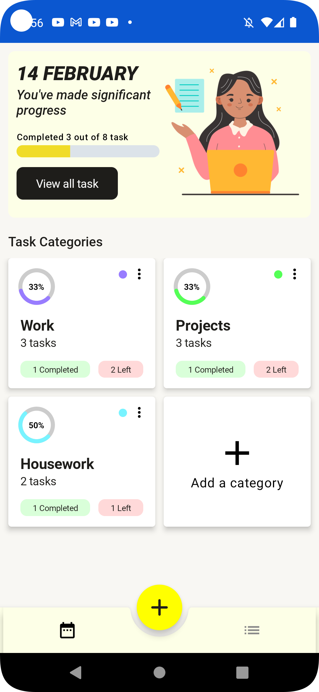
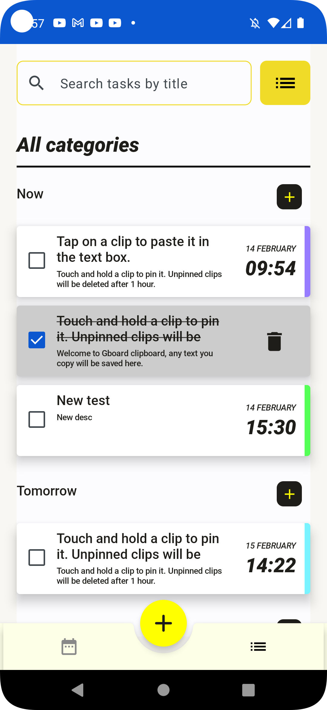
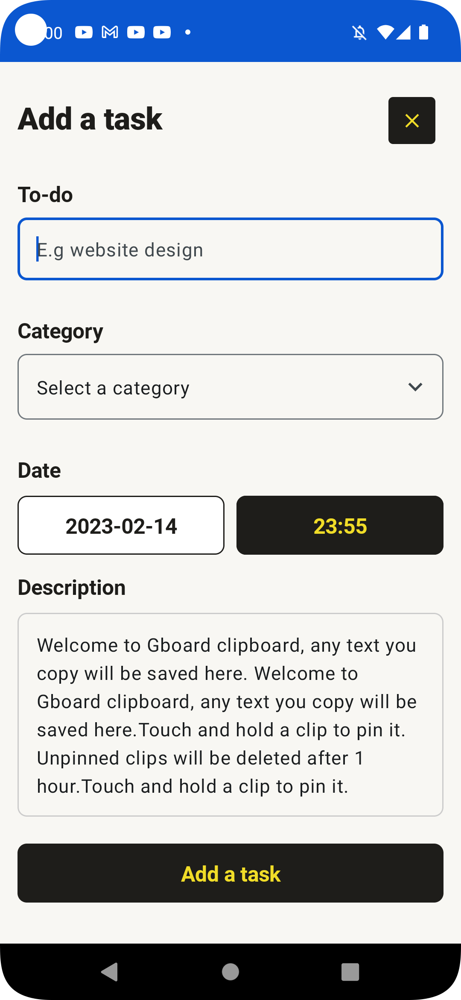

# Jetpack Compose App - To Do List
  

___

### Technologies used

* UI completely in [Jetpack Compose](https://developer.android.com/jetpack/compose)
* [Kotlin Coroutines](https://kotlinlang.org/docs/coroutines-guide.html)
* [Kotlin Flow](https://kotlinlang.org/docs/flow.html)
* Many of the [Architecture Components](https://developer.android.com/topic/architecture),
  including: Room, DataStore, Navigation, ViewModel
* [Hilt](https://dagger.dev/hilt/) for dependency injection

___

### Application view (GIF)

##### Progress screen
<table>
  <tr>
    <td align="center">Screen view</td>
    <td align="center">Add a category</td>
    <td align="center">Edit / Delete a category</td>
  </tr>
  <tr>
    <td></td>
    <td></td>
    <td></td>
  </tr>
</table>

 

##### To do list screen
<table>
  <tr>
    <td align="center">A certain category / All categories</td>
    <td align="center">Search / Filter</td>
    <td align="center">Edit / Add / Delete a task</td>
  </tr>
  <tr>
    <td></td>
    <td></td>
    <td></td>
  </tr>
</table>

 